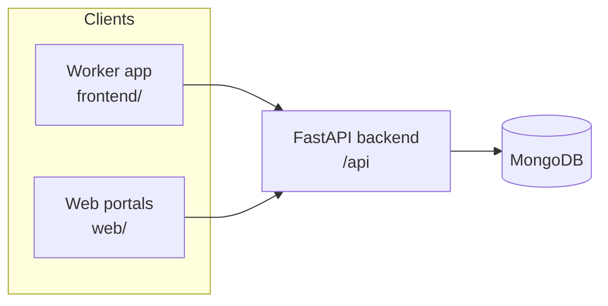

# Rojgaar

**Rojgaar** is a blue-collar job platform for India. It connects workers (masons, electricians, drivers, helpers, and similar roles) with small and medium businesses, and lets placement partners onboard candidates and track placements.

The repo is a monorepo with three client surfaces and one shared API:

| Package | Stack | Purpose |
|---------|--------|---------|
| [`frontend/`](frontend/) | Expo + React Native (Expo Router) | Worker mobile app (iOS / Android / web) |
| [`web/`](web/) | React + Vite + React Router | Marketing site + Business & Partner web portals |
| [`backend/`](backend/) | FastAPI + Motor (MongoDB) | REST API at `/api` |

---

## Architecture



**Roles**

- **Worker** — browses jobs, applies, saves listings, completes a multi-step profile onboarding (mobile app).
- **Business** — posts jobs, views applications, accepts/rejects candidates (web portal).
- **Partner** — registers workers on their behalf with OTP verification, tracks candidates and earnings (web portal).

---

## Features

### Worker app (`frontend/`)

- Phone + OTP sign-in (mock: any 4-digit code)
- Onboarding: language → phone → OTP → personal info (name, gender, age) → city → industry → skills → experience & salary → work type → ready
- Languages: English, Hindi, Kannada (Tamil/Telugu/Marathi shown as coming soon)
- Bottom tabs: **Home**, **Jobs**, **Activity**, **Profile**
- Job search, filters, detail pages, save jobs, apply (Call to Apply)
- Profile strength meter and full profile edit
- Job listings support Hindi/Kannada translations where seeded
- In-app **Business** and **Partner** portal previews (`/business`, `/partner`) with demo auto-login

### Web app (`web/`)

- **Landing page** — product overview and app download CTAs
- **Portal gateway** (`/portal`) — choose Business or Partner
- **Business portal** — stats, job list, post jobs, review/accept/reject applications
- **Partner portal** — stats, candidate table, add people with full worker details + employee OTP verification

### Backend (`backend/`)

- REST API with Pydantic schemas and MongoDB persistence
- Auto-seeds jobs, demo business, demo partner, and sample candidates on startup
- Mock OTP (no SMS provider; any 4-digit code is accepted)

---

## Getting started

### Prerequisites

- **Node.js** 18+ and npm (or yarn for `frontend/`)
- **Python** 3.10+
- **MongoDB** (local or Atlas)

### 1. Backend

```bash
cd backend
python3 -m venv .venv
source .venv/bin/activate   # Windows: .venv\Scripts\activate
pip install -r requirements.txt
```

Create `backend/.env`:

```env
MONGO_URL=mongodb://localhost:27017
DB_NAME=rojgaar
```

Run the API:

```bash
uvicorn server:app --reload --host 0.0.0.0 --port 8000
```

- Health check: `GET http://localhost:8000/api/` → `{"status":"ok"}`
- OpenAPI docs: `http://localhost:8000/docs`

### 2. Web (marketing + portals)

```bash
cd web
npm install
npm run dev
```

Dev server: **http://localhost:5173**

Vite proxies `/api` to `http://localhost:8000` by default. For a remote API, set:

```env
# web/.env
VITE_BACKEND_URL=http://localhost:8000
```

| Script | Description |
|--------|-------------|
| `npm run dev` | Dev server on port 5173 |
| `npm run build` | Production build |
| `npm run preview` | Preview production build |

See [`web/README.md`](web/README.md) for portal routes and demo logins.

### 3. Worker mobile app

```bash
cd frontend
npm install   # or yarn install
npx expo start
```

Point the app at your API with:

```env
# frontend/.env
EXPO_PUBLIC_BACKEND_URL=http://localhost:8000
```

Use a reachable URL when testing on a physical device (e.g. your machine’s LAN IP or a tunnel).

| Script | Description |
|--------|-------------|
| `npm start` / `npx expo start` | Start Metro bundler |
| `npm run android` | Open on Android |
| `npm run ios` | Open on iOS simulator |
| `npm run web` | Run in browser |

---

## Authentication flows

OTP is **mocked** everywhere: send OTP always succeeds; verify accepts any **4-digit** numeric code.

### Business & Partner (web)

1. Enter phone → **Send OTP**
2. Enter OTP → verify
3. **New user** (`needs_profile: true`) → name (+ company for business) + city → dashboard
4. **Returning user** → straight to dashboard

Session is stored in `localStorage` (`rojgaar.web.session`).

### Worker (mobile)

1. Language → phone → OTP
2. New or incomplete profile → onboarding steps
3. Complete profile → home tabs

### Partner adding an employee

1. Partner fills employee details (name, phone, gender, age, collar type, skill, experience, location)
2. **Send OTP** to employee’s phone
3. Partner enters OTP received by employee → candidate + worker profile created

---

## Demo accounts

| Role | Phone | Notes |
|------|-------|--------|
| Business | `9999999999` | Ravi Sharma / Sharma Construction — profile complete |
| Partner | `8888888888` | Ramesh Kumar — 4 seeded candidates |
| Worker | any new 10-digit | Created on first OTP verify |

OTP: any 4 digits (e.g. `1234`, `0000`).

---

## API reference

Base path: `/api`

### Auth

| Method | Path | Description |
|--------|------|-------------|
| POST | `/auth/send-otp` | `{ phone, role }` — `role`: `worker` \| `business` \| `partner` |
| POST | `/auth/verify-otp` | `{ phone, otp, role }` — returns `user`, `is_new`, and for business/partner `needs_profile` |

### Workers

| Method | Path | Description |
|--------|------|-------------|
| GET | `/workers/{id}` | Worker profile + profile strength |
| PATCH | `/workers/{id}` | Update profile fields |

### Jobs

| Method | Path | Description |
|--------|------|-------------|
| GET | `/jobs` | List jobs (query: `city`, `industry`, `search`, `salary_min`, etc.) |
| GET | `/jobs/{id}` | Job detail |
| POST | `/jobs` | Create job |
| DELETE | `/jobs/{id}` | Soft-delete (sets `active: false`) |

### Applications & saved jobs

| Method | Path | Description |
|--------|------|-------------|
| POST | `/applications` | Apply to a job |
| GET | `/applications?worker_id=` | List applications |
| PATCH | `/applications/{id}` | Update status (`Accepted`, `Rejected`, etc.) |
| POST/GET/DELETE | `/saved-jobs` | Save, list, unsave jobs |

### Businesses

| Method | Path | Description |
|--------|------|-------------|
| GET | `/businesses/{id}` | Business profile |
| PATCH | `/businesses/{id}` | Complete profile (`name`, `company`, `city`) |
| GET | `/businesses/{id}/stats` | Dashboard stats |
| GET | `/businesses/{id}/jobs` | Posted jobs |
| GET | `/businesses/{id}/applications` | Applications with job + worker details |

### Partners

| Method | Path | Description |
|--------|------|-------------|
| GET | `/partners/{id}` | Partner profile |
| PATCH | `/partners/{id}` | Complete profile (`name`, `city`) |
| GET | `/partners/{id}/stats` | Dashboard stats |
| GET | `/partners/{id}/candidates` | Registered candidates |
| POST | `/partners/{id}/candidates/request-otp` | Start employee registration |
| POST | `/partners/{id}/candidates/confirm` | Confirm with employee OTP |

### Meta

| Method | Path | Description |
|--------|------|-------------|
| GET | `/meta/cities` | Nearby and popular cities |
| GET | `/meta/industries` | Industry list |
| GET | `/meta/skills` | Skill list |

---

## Project structure

```
Rojgaar/
├── backend/
│   ├── server.py              # FastAPI app entry
│   ├── database.py            # MongoDB client
│   ├── schemas.py             # Pydantic models
│   ├── routers/               # Route modules (auth, jobs, workers, …)
│   ├── services/              # Business logic helpers
│   ├── seed/                  # Jobs, translations, demo data
│   └── tests/                 # pytest API tests
├── frontend/                  # Expo worker app
│   ├── app/                   # Expo Router screens
│   │   ├── (tabs)/            # Home, Jobs, Activity, Profile
│   │   ├── onboarding/        # Worker onboarding flow
│   │   ├── business.tsx       # Business portal (demo)
│   │   └── partner.tsx        # Partner portal (demo)
│   └── src/                   # API client, i18n, components, store
├── web/                       # Vite React web app
│   └── src/
│       ├── pages/             # Landing, business/partner auth & dashboards
│       ├── components/        # OtpForm, PortalLayout, Logo
│       └── api/client.ts      # API client
└── memory/
    └── PRD.md                 # Product notes (may lag behind code)
```

---

## Testing

Backend tests live in `backend/tests/`:

```bash
cd backend
source .venv/bin/activate
pytest tests/ -v
```

Tests hit the API over HTTP. By default they use `EXPO_PUBLIC_BACKEND_URL` or a hosted preview URL; point at local with:

```bash
EXPO_PUBLIC_BACKEND_URL=http://localhost:8000 pytest tests/ -v
```

Key suites:

- `test_rojgaar_api.py` — auth, jobs, workers, businesses, partners, meta
- `test_iteration2.py` — worker gender/age, job translations, idempotent apply

---

## Environment variables

| Variable | Where | Description |
|----------|--------|-------------|
| `MONGO_URL` | `backend/.env` | MongoDB connection string |
| `DB_NAME` | `backend/.env` | Database name |
| `VITE_BACKEND_URL` | `web/.env` | API origin for web client (optional; Vite proxy used in dev) |
| `EXPO_PUBLIC_BACKEND_URL` | `frontend/.env` | API origin for mobile app |

---

## Seeded data

On first startup the backend seeds:

- **11+ jobs** (construction, electrician, driver, etc.) with optional Hindi/Kannada translations
- **Demo business** — Sharma Construction (`9999999999`)
- **Demo partner** — Ramesh Kumar (`8888888888`) with 4 sample candidates

---

## Web routes

| Path | Page |
|------|------|
| `/` | Landing |
| `/portal` | Business / Partner picker |
| `/business/login` | Business phone → OTP → profile (if new) |
| `/business/dashboard` | Business dashboard |
| `/partner/login` | Partner phone → OTP → profile (if new) |
| `/partner/dashboard` | Partner dashboard |

---

## Tech stack summary

| Layer | Technologies |
|-------|----------------|
| Mobile | Expo 54, React Native, Expo Router, AsyncStorage |
| Web | React 19, Vite 8, React Router 7, Lucide icons |
| API | FastAPI, Motor, Pydantic v2, Uvicorn |
| Data | MongoDB |
| Auth | Phone + OTP (mock) |

---

## License

Private project — see repository owner for usage terms.
